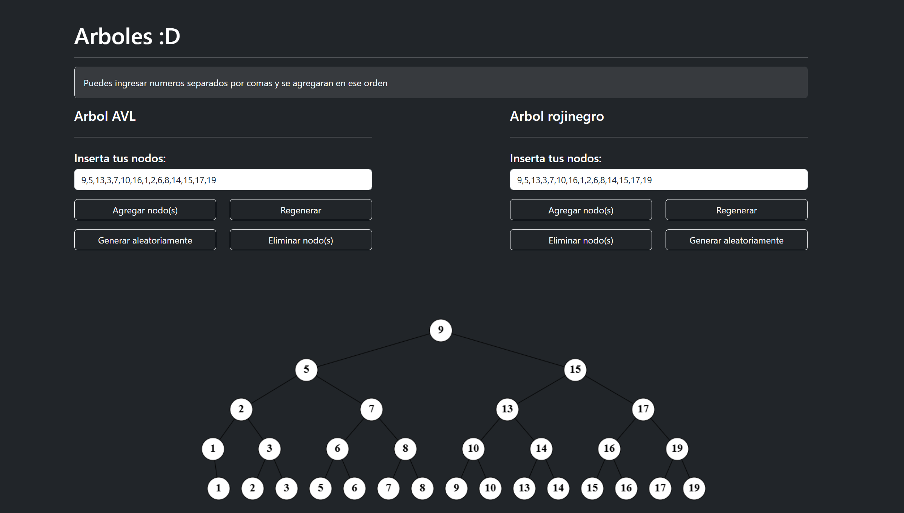

# Visualizador de Árboles AVL y Rojinegros

Esta es una aplicación web desarrollada con **HTML**, **Bootstrap** y **JavaScript** que permite la visualización e interacción con dos tipos de estructuras de datos balanceadas: **árboles AVL** y **árboles Rojinegros**. El propósito de esta herramienta es facilitar el aprendizaje y comprensión del comportamiento de estos árboles mediante una interfaz intuitiva y visual.

## Características

-   Visualización gráfica de árboles AVL y Rojinegros.
-   Inserción y eliminación de nodos con reestructuración automática del árbol.
-   Interfaz responsiva compatible con dispositivos móviles y de escritorio.
-   Separación de lógica y presentación para facilitar su mantenimiento.

## Tecnologías utilizadas

-   **HTML5**: Estructura y contenido de la aplicación.
-   **Bootstrap 5**: Estilización y diseño responsivo.
-   **JavaScript (vanilla)**: Lógica de funcionamiento de los árboles y manejo de eventos.

## Visualizacion de la aplicacion

